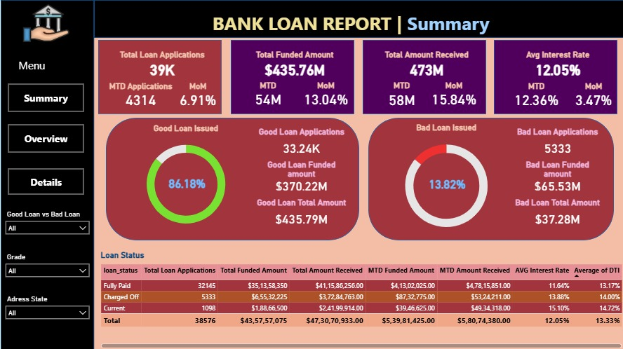
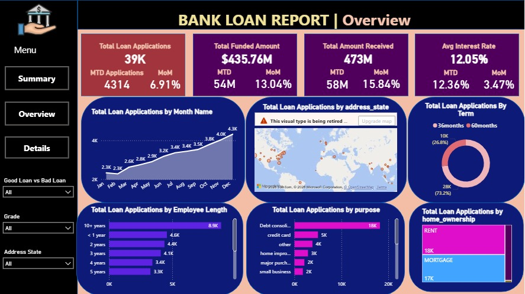
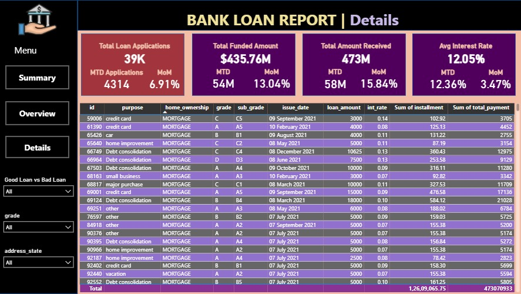

# Bank_Loan_PowerBI

## Overview

This project is an interactive Power BI dashboard built to analyze and monitor bank loan performance. It provides a clear view of key lending metrics, helping users understand loan trends, repayment performance, and the overall health of the loan portfolio. The dashboard uses DAX calculations and interactive visualizations to make business insights easy to explore.

The project focuses on tracking loan applications, funded amounts, total amount received, loan status, interest rates, and loan quality. By using dynamic filters and time-based calculations, users can compare performance across different periods and make informed decisions.

---

## Project Objectives

* Analyze overall bank loan performance.
* Track loan applications and lending trends.
* Compare funded amount with total amount received.
* Monitor loan repayment status.
* Analyze Good Loans and Bad Loans.
* Build interactive dashboards for business reporting.
* Create reusable DAX measures for KPI analysis.

---

## Dashboard Features

* Total Loan Applications
* Total Funded Amount
* Total Amount Received
* Average Interest Rate
* Average Debt-to-Income (DTI)
* Good Loan vs Bad Loan Analysis
* Fully Paid, Current, and Charged-Off Loan Status
* Year-wise and Monthly Loan Trends
* Interactive Filters and Slicers
* Dynamic KPI Cards
* Detailed Loan Records

---

## DAX Measures Used

* Month-to-Date (MTD)
* Month-over-Month (MOM)
* Year-to-Date (YTD)
* Previous Month Comparisons
* Total Loan Applications
* Total Funded Amount
* Total Amount Received
* Average Interest Rate
* Average DTI
* Good Loan Percentage
* Bad Loan Percentage
* Loan Status KPIs

---

## Tools Used

* Power BI Desktop
* Power Query
* DAX (Data Analysis Expressions)
* Microsoft Excel

---

## Dashboard Pages

### Summary Dashboard

Provides an overview of the most important KPIs, including loan applications, funded amount, total amount received, interest rate, DTI, and Good Loan vs Bad Loan analysis.



---

### Overview Dashboard

Displays loan trends across different months, loan purpose, employee length, home ownership, loan term, and geographical distribution using interactive charts and filters.



---

### Details Dashboard

Displays detailed loan-level records, allowing users to explore loan information using filters and slicers for deeper analysis.



---

## Repository Structure

```text
Bank_Loan_PowerBI/
│── Bank_Loan_Dashboard.pbix
│── Bank_Loan_Data.csv
│── README.md
└── Images/
    ├── Summary.jpeg
    ├── Overview.jpeg
    └── Details.jpeg
```

---

## What I Learned

While building this project, I gained practical experience in:

* Data cleaning and transformation using Power Query
* Creating DAX measures for business KPIs
* Building interactive Power BI dashboards
* Data modeling and relationships
* Designing reports for better business insights
* Creating dynamic MTD, MOM, and YTD calculations


## Author

**Phanindhra Gadepalli**
